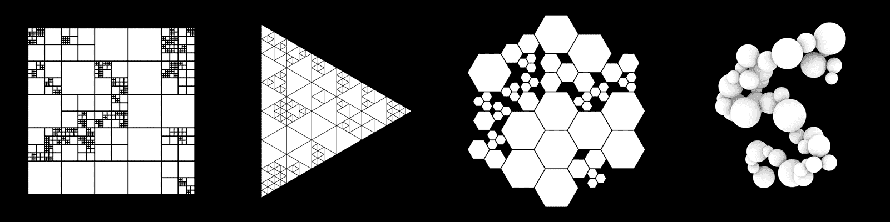
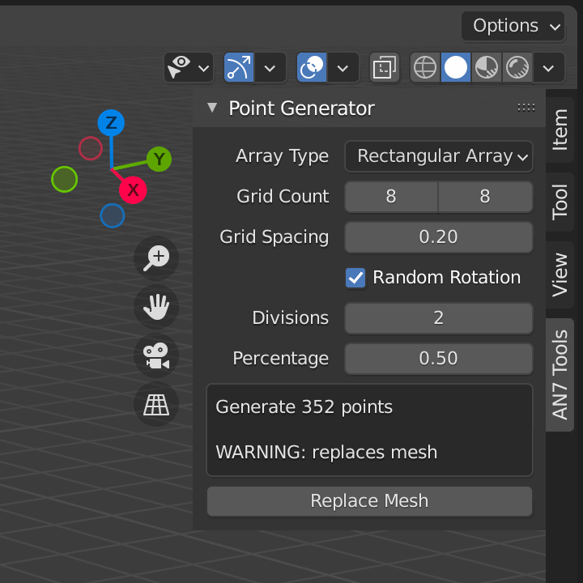
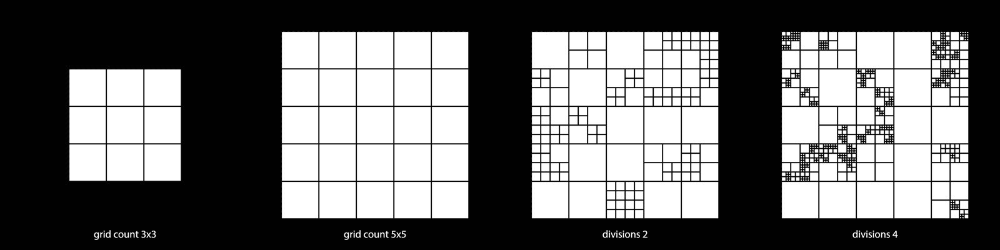
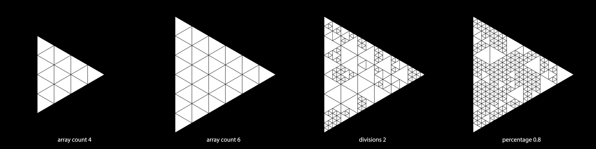
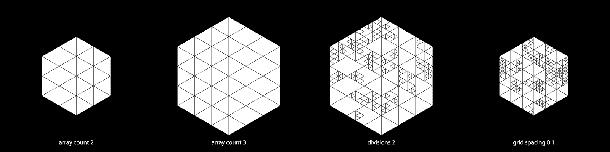
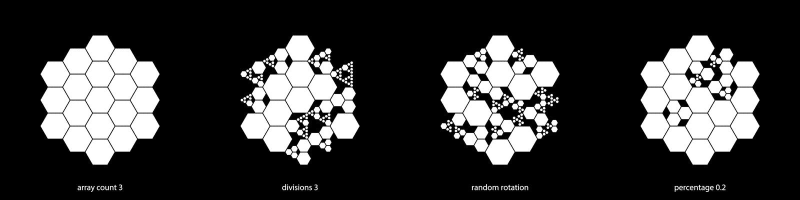
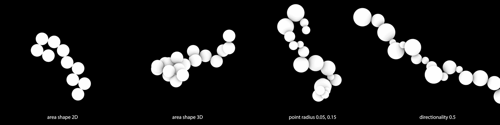
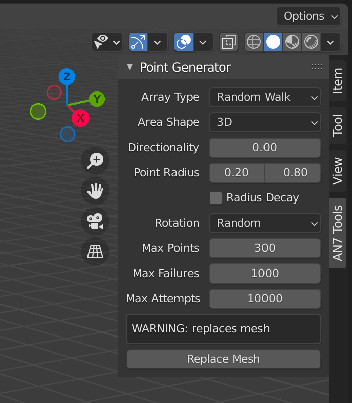
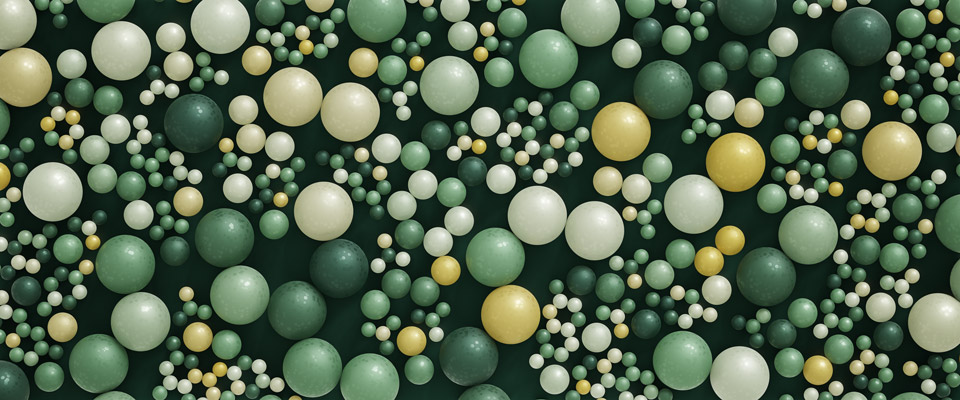
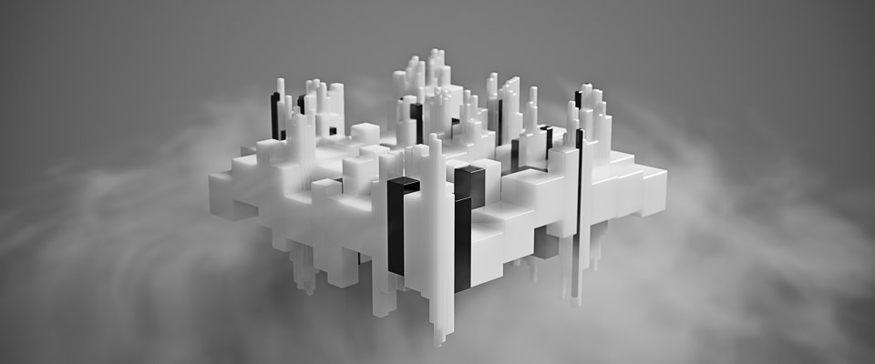

# AN7 Point Generator

Generates random walk and subdivided point arrays for use with Blender Geometry Nodes

## Installation and Usage

- Download the .py add-on file
- Install in the Blender Preferences > Add-ons tab
- Enable the plugin
- Create two objects: one for the script to replace with an array of points, and one to be instanced
- Set up Geometry Nodes to instance the second object onto the points of the first
- In the 3D viewport, choose the settings you want to use and replace the mesh of the array object

## Settings

- There are five available `Array Types` to choose from, with individual settings detailed below
- The info box will let you know how many points are going to be generated usign the selected settings

### Rectangular Array

This creates a grid array with any number of constituent elements.

- `Grid Count` defines the number of X and Y elements to generate prior to subdivision
- `Grid Spacing` controls the size in meters of the base element prior to subdivision, and assumes the instances will be a default Blender Cube of 2m (when set to 0.2, it will scale a 2m object to 10% in Geometry Nodes, resulting in 0.2m instances)
- `Random Rotation` will set the point rotation in 90° increments
- `Divisions` is the level of subdivision recursions (set to zero, no subdivisions will occur and just the simple first-level array will be generated)
- `Percentage` sets the number of elements that will be subdivided in each recursion

### Triangular Array

A triangle built out of triangles; it's a triangular array.

- `Array Count` defines the number of rows to generate prior to subdivision (in contrast to the hexagonal arrays, this will require higher values for a similar number of output elements)
- `Grid Spacing` controls the size in meters of the base element prior to subdivision, and assumes the instances will be a default Blender Cylinder set to 3 sides with a 1m radius (any object shape can be used, but this is what the generated array attributes are designed to work best with)
- `Random Rotation` will set the point rotation in 120° increments
- `Divisions` is the level of subdivision recursions (set to zero, no subdivisions will occur and just the simple first-level array will be generated)
- `Percentage` sets the number of elements that will be subdivided in each recursion

### Tri-Hex Array

Same as above, but this array of triangles forms a hexagonal macro shape instead.

- `Array Count` defines the number of hexagonal rings to generate prior to subdivision (in contrast to the triangular array, this value should be lower for a similar number of output elements)
- `Grid Spacing` controls the size in meters of the base element prior to subdivision, and assumes the instances will be a default Blender Cylinder set to 3 sides with a 1m radius (any object shape can be used, but this is what the generated array attributes are designed to work best with)
- `Random Rotation` will set the point rotation in 120° increments
- `Divisions` is the level of subdivision recursions (set to zero, no subdivisions will occur and just the simple first-level array will be generated)
- `Percentage` sets the number of elements that will be subdivided in each recursion

### Hexagonal Array

While it's impossible to evenly divide a hexagon into more hexagons, this option splits each hexagon into three sub-hexagons in each iteration. The results will include lots of gaps (recursive divisions will not track neighboring areas that could be filled with smaller hexagons), but can still be quite useful.

- `Array Count` defines the number of hexagonal rings to generate prior to subdivision (in contrast to the triangular array, this value should be lower for a similar number of output elements)
- `Grid Spacing` controls the size in meters of the base element prior to subdivision, and assumes the instances will be a default Blender Cylinder set to 3 sides with a 1m radius (any object shape can be used, but this is what the generated array attributes are designed to work best with)
- `Random Rotation` will set the point rotation in 60° increments (this will also break up the repeating three-hexagon subdivision patterns that emerge)
- `Divisions` is the level of subdivision recursions (set to zero, no subdivisions will occur and just the simple first-level array will be generated)
- `Percentage` sets the number of elements that will be subdivided in each recursion

### Random Walk

This is definitely the oddest array system out of the bunch, and generates a string of spheres with connected radii. Because this is entirely random, controls are included for tuning the performance and preventing runaway processing (setting a cap on the total number of attempts to place a new random sphere, for example).

- `Area Shape` lets you choose betwee:
	- `2D` area, where all points will be generated in just the X and Y axis
	- `3D` area, where points will be randomly generated in all three dimensions
- `Directionality` will force point generation to trend in a specific direction, set using the vector fields that appear whenever this setting is over 0.0
	- `Vector X/Y/Z` allows you to set a custom vector for the direction to trend in
- `Point Radius` minimum and maximum values control the range of possible sphere sizes
- `Radius Decay` interpolates the random radius values down to the minimum value only as the processing continues
- `Rotation` allows you to choose:
	- `Random` where each point instance is rotated randomly (helpful when using textured spheres)
	- `Look Ahead` where each point instance is aligned to the next point in the sequence
	- `Look Behind` where each point instance is aligned to the previous point in the sequence (these last two are mostly helpful on non-spherical objects with specific directional requirements...note that it's not possible to create a string of oblong beads because the placement is based entirely on sphere radii, not start and end points)
- `Max Points` sets the maximum number of points that will be generated
- `Max Failures` sets the maximum number of times the algorithm will attempt to place a random point before it stops (helps prevent stalling when placing a sphere in a congested area becomes too difficult)
- `Max Attempts` sets the maximum number of total attempts (helps prevent stalling regardless of other limts set)

## Demo Files

[demo-trihex.blend](images/demo-trihex.blend.zip)

[demo-square.blend](images/demo-square.blend.zip)

